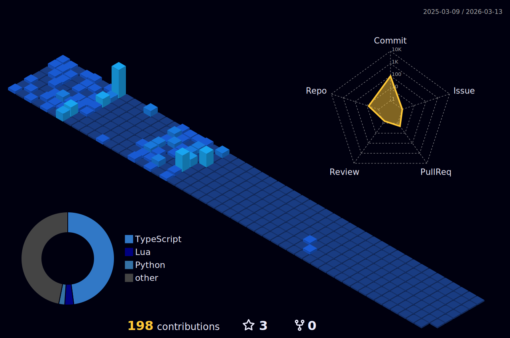

## Hi there 👋

<!--
**cp200513/cp200513** is a ✨ _special_ ✨ repository because its `README.md` (this file) appears on your GitHub profile.

Here are some ideas to get you started:

- 🔭 I’m currently working on ...
- 🌱 I’m currently learning ...
- 👯 I’m looking to collaborate on ...
- 🤔 I’m looking for help with ...
- 💬 Ask me about ...
- 📫 How to reach me: ...
- 😄 Pronouns: ...
- ⚡ Fun fact: ...
-->

<!--
<picture>
  <source media="(prefers-color-scheme: dark)" srcset="https://raw.githubusercontent.com/cp200513/cp200513/profile-3d-contrib/profile-night-rainbow.svg" />
  <source media="(prefers-color-scheme: light)" srcset="https://raw.githubusercontent.com/cp200513/cp200513/profile-3d-contrib/profile-gitblock.svg" />
  
</picture>
-->

<picture>
  <source media="(prefers-color-scheme: dark)" srcset="https://raw.githubusercontent.com/cp200513/cp200513/output/github-snake-dark.svg" />
  <source media="(prefers-color-scheme: light)" srcset="https://raw.githubusercontent.com/cp200513/cp200513/output/github-snake.svg" />
  
</picture>
